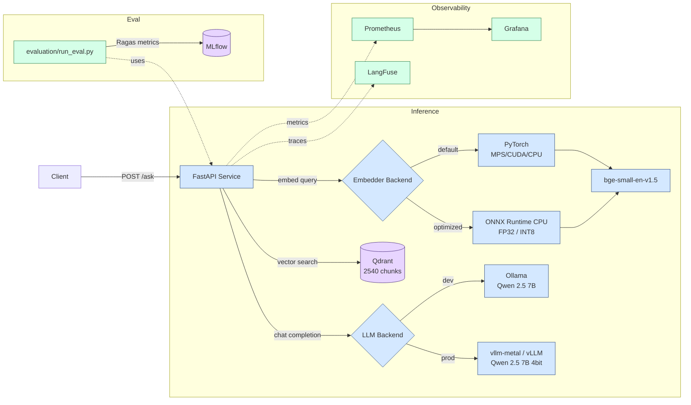

# DocsRAG

[](https://github.com/MaxBarannikov/DocsRAG/actions/workflows/ci.yml)
[](https://www.python.org/downloads/)
[](https://github.com/astral-sh/ruff)

Self-hosted RAG system for question answering over technical documentation, built end
to end over the FastAPI docs (153 markdown files, 2540 chunks).

- **Evaluation-driven.** Every retrieval and generation decision is backed by Ragas
  metrics on a 25-question golden dataset, tracked in MLflow.
- **Honest negative results.** Agentic RAG and INT8 quantization were measured, lost,
  and kept in the README with the numbers and the reasons.
- **Switchable inference.** The same code runs against Ollama or vLLM through one env
  variable. On an M4 Max, vllm-metal generates ≈3.8× faster than Ollama.
- **Switchable embedder.** The same factory pattern covers sentence-transformers and
  ONNX Runtime. ONNX-CPU-FP32 is ≈3.4× faster than PyTorch-MPS on single-query latency
  with byte-identical retrieval.
- **Cross-language Q&A.** Ask in Russian, get Russian back, via a translation wrapper
  over the English-only index — no reindex, no multilingual model.
- **Full observability.** Prometheus and Grafana for system metrics, LangFuse for LLM
  tracing, both entirely optional and additive.

## Tech Stack

| Layer | Technology |
|---|---|
| API | FastAPI + Pydantic |
| LLM | Qwen 2.5 7B Instruct via Ollama (dev) or vllm-metal MLX (prod) |
| Embeddings | BAAI/bge-small-en-v1.5 — 384-dim, normalized for cosine |
| Embedder runtime | `pytorch` (MPS/CUDA/CPU) · `onnx-fp32` · `onnx-int8` |
| Vector DB | Qdrant |
| Orchestration | LangChain + LangGraph |
| Retrieval | Dense · BM25 · RRF fusion · cross-encoder reranking |
| Evaluation | Ragas + MLflow |
| Observability | LangFuse, Prometheus, Grafana |
| Packaging | Docker, Docker Compose, uv |

## Architecture



The API is the only stateful service. Ollama and vLLM are interchangeable stateless
inference servers selected by `INFERENCE_BACKEND`; the embedder is swapped the same way
via `EMBEDDER_BACKEND`. Observability is additive — the system runs unchanged without
LangFuse keys or with Prometheus stopped.

## Key Findings

The results worth knowing, each of which only shows up once you measure.

**1. Chunk size and top-k are not interchangeable knobs.** Chunk size buys precision:
growing chunks from 256 to 1024 lifts faithfulness by 0.246 and context_precision by
0.133. `top_k` buys recall: going from 3 to 10 chunks lifts context_recall by 0.233 and
leaves precision flat. Moving from `512, top_k=10` to `1024, top_k=5` therefore trades
one for the other — precision +0.090 and faithfulness +0.015 against context_recall
−0.130 — while halving the chunks sent to the LLM. "Tune chunk size, then tune top_k"
treats them as one dial; they are two.

**2. Rank fusion widens coverage more cheaply than a larger top-k.** Hybrid retrieval
beats dense by +0.140 context_recall and +0.036 context_precision, and reaches recall
0.570 on five chunks — a level the dense sweep only reached by sending ten. Combining a
sparse and a dense signal finds material that neither ranks highly on its own, which is
not the same thing as simply asking one index for more results. What it costs is
answer_relevancy: more context makes for longer, less focused answers.

**3. Agentic RAG trades recall for precision, it is not a free win.** A LangGraph agent
with relevance grading improved context_precision by +0.055 and cut context_recall by
−0.107: the binary grader discards borderline chunks that actually contained answers.

**4. ONNX on CPU beat PyTorch on MPS.** bge-small is 30M parameters — small enough that
ORT's per-call overhead and graph optimizations dominate over MPS dispatch cost.
Single-query latency 1.7 ms vs 5.7 ms p50, with cosine parity of 1.0. "GPU always wins"
is wrong below ~100M parameters.

**5. INT8 noise is invisible per-vector and fatal in aggregate.** Quantized vectors sit
at 0.997 mean cosine against FP32 — and that is enough to reshuffle top-5 and drop
context_recall by 0.070 (12.6% relative), well past the 0.05 budget. Cosine-of-same-text
is not a sufficient quantization gate; end-to-end retrieval metrics are.

**6. Cosine plus normalized embeddings is non-negotiable.** Without
`normalize_embeddings=True` retrieval degrades silently — no error, no exception,
nothing visible until Ragas puts a number on it.

## Quick Start

> Developed and tested on Apple Silicon (M4 Max). Qdrant, the API and MLflow run in
> Docker and are platform-agnostic; Ollama, MPS embeddings and vllm-metal are
> macOS-ARM64 specific.

**Prerequisites:** Docker Desktop, Python 3.12, [uv](https://docs.astral.sh/uv/), and
the [Ollama](https://ollama.com) macOS app (it runs natively so it can use the GPU).

```bash
git clone https://github.com/MaxBarannikov/DocsRAG.git
cd DocsRAG

make install                 # uv venv + dependencies
source .venv/bin/activate    # the indexing/eval/benchmark targets call python directly
cp .env.example .env         # every value has a working default

ollama pull qwen2.5:7b-instruct-q4_K_M
make up                      # Qdrant, API, Prometheus, Grafana, MLflow
make fetch-docs && make reindex
make warmup

make ask Q='How do I define a path parameter in FastAPI?'
```

The first API start takes 30–60 s while the embedding model downloads (≈130 MB of
weights; the full Hugging Face cache comes to ≈470 MB).

Two optional settings in `.env`: `HF_TOKEN` (only for gated or rate-limited models —
bge-small is public) and `API_KEY` (see [Authentication](#authentication)). Do not quote
values: `make` reads the file with its own parser, which keeps quotes as part of the
value.

Run `make help` for the full target list.

## API

Served on `http://localhost:8000`. Interactive docs at `/docs`.

| Endpoint | Purpose |
|---|---|
| `GET /health` | Collection status, point count, active backends. 503 when Qdrant is unreachable. |
| `POST /ask` | Retrieve then generate. Returns the answer, its sources, and per-stage timings. |
| `POST /agent/ask` | Same shape, routed through the LangGraph agent; adds `rewrite_ms`, `grading_ms`, `retry_count`. |
| `GET /metrics` | Prometheus exposition. |

Request fields: `question` (required), `top_k` (default 5), `include_contexts`
(default false — raw chunk text is omitted from production responses).

### Cross-language support

Both answering endpoints accept Russian without any flag. The pipeline detects
Cyrillic, translates to English for retrieval and generation, then translates the
answer back. English questions short-circuit both hops and pay nothing.

```bash
make ask Q='Как определить path-параметр в FastAPI?'
```

Costs two extra LLM calls, reported separately as `translation_ms`. Model choice
matters more than quantization here: Qwen2.5-7B-4bit under MLX garbles Cyrillic
mid-word, while 14B-4bit and Ollama's GGUF build both handle it cleanly.

### Authentication

Both answering endpoints are unauthenticated by default, which is right for localhost
and nowhere else — each `/ask` costs an LLM generation, and `/agent/ask` costs up to
`top_k` grader calls on top. Set `API_KEY` in `.env` to require an `X-API-Key` header.

## Evaluation

Ragas metrics over a 25-question golden dataset. Every run is written to
`data/eval_runs/` and logged to MLflow with its parameters, the prompt content hash and
the versions of the judging stack.

```bash
make eval CONFIG=configs/chunk_1024.yaml
make mlflow-ui
```

`chunk_size` and `chunk_overlap` in a config describe the index a run expects to query;
they do not re-chunk anything. Build the matching index first — the harness reads the
parameters back from the collection and reports a mismatch.

### Chunk size and top-k

Dense retrieval, one config per row.

| Config | chunk_size | overlap | top_k | faithfulness | answer_relevancy | context_precision | context_recall |
|---|---|---|---|---|---|---|---|
| chunk_256 | 256 | 25 | 5 | 0.621 | 0.702 | 0.457 | 0.363 |
| baseline | 512 | 50 | 5 | 0.795 | 0.931 | 0.517 | 0.397 |
| topk_3 | 512 | 50 | 3 | 0.776 | 0.818 | 0.470 | 0.327 |
| topk_10 | 512 | 50 | 10 | 0.852 | 0.894 | 0.500 | **0.560** |
| **chunk_1024** ✓ | **1024** | **100** | **5** | **0.867** | **0.939** | **0.590** | 0.430 |

The two parameters move different metrics. At `top_k=5`, growing chunks from 256 to
1024 lifts faithfulness by 0.246 and context_precision by 0.133. At 512 characters,
growing `top_k` from 3 to 10 lifts context_recall by 0.233 and leaves precision flat.
Chunk size buys precision; `top_k` buys recall.

**`chunk_1024` is the baseline** — best on three metrics of four, at half the context
of `topk_10`. Its context_recall of 0.430 is the price of asking for only five chunks.

### Retrieval strategies

At `chunk_size=1024, top_k=5`.

| Strategy | faithfulness | answer_relevancy | context_precision | context_recall | retrieval p50 |
|---|---|---|---|---|---|
| **dense** ✓ | 0.867 | **0.939** | 0.590 | 0.430 | **43 ms** |
| hybrid | 0.881 | 0.806 | **0.626** | **0.570** | 137 ms |
| hybrid_rerank | **0.896** | 0.819 | 0.622 | 0.477 | 152 ms |

Hybrid retrieves more of what an answer needs: +0.140 context_recall and +0.036
context_precision over dense. It also reaches recall 0.570 on five chunks, which the
sweep above only reached by sending ten — fusing two retrieval signals widens coverage
more cheaply than asking the dense index for more results. Reranking trades part of
that recall back for the best faithfulness of the three, since cutting 20 candidates to
5 drops borderline context.

Dense wins answer_relevancy by a wide margin; its answers are shorter and address the
question more directly, where hybrid's extra context produces longer, more diffuse ones.

**Dense is the production default** — it needs no BM25 index, retrieves 3× faster, and
answer_relevancy is the metric a user feels most directly. `RETRIEVAL_STRATEGY=hybrid`
switches to the higher-coverage trade in one environment variable.

### Agentic RAG

`/agent/ask` runs `query_rewriter → retriever → relevance_grader → generator`, looping
back to rewriting when fewer than 2 chunks pass grading, at most once. Measured in a
separate run against its own dense baseline.

| Strategy | faithfulness | answer_relevancy | context_precision | context_recall |
|---|---|---|---|---|
| dense | **0.882** | 0.886 | 0.598 | **0.557** |
| agentic | 0.817 | 0.813 | **0.653** | 0.450 |

Precision up, recall down: the binary grader discards borderline chunks that turn out
to contain answers. Worth it when precision matters more than coverage.

## Optimization experiments

### vLLM backend

`INFERENCE_BACKEND=vllm` points the same `ChatOpenAI` client at a
[vllm-metal](https://github.com/vllm-project/vllm-metal) endpoint. The code path is
identical to production vLLM on CUDA — swap the image and set `VLLM_BASE_URL`.

| Backend | avg gen | p50 | min | max |
|---|---|---|---|---|
| Ollama (Qwen2.5-7B q4_K_M, llama.cpp) | 3375 ms | 3439 ms | 2064 ms | 4327 ms |
| **vllm-metal (Qwen2.5-7B 4bit, MLX)** | **891 ms** | **911 ms** | **705 ms** | **1075 ms** |

Retrieval metrics are identical across backends (same index); faithfulness differs by
−0.055 and answer_relevancy by +0.021, which is quantization-format noise at 25 samples.

Install with `make install-vllm` — vllm and the metal plugin cannot live in `uv.lock`,
because vllm's own metadata hard-pins CUDA packages that have no macOS wheels.

### ONNX embedder

Three runtimes behind one factory, selected by `EMBEDDER_BACKEND`.
`settings.active_qdrant_collection` routes INT8 to its own collection automatically,
since its vectors differ from FP32.

```bash
make install-onnx && make export-onnx && make quantize-onnx
make bench-embedder VERIFY=1     # VERIFY cross-checks each backend against PyTorch
```

**Single-query latency** (M4 Max, 50 runs, 10 warmup):

| Backend | p50 | p95 | p99 |
|---|---|---|---|
| PyTorch-MPS | 5.7 ms | 9.0 ms | 9.2 ms |
| PyTorch-CPU | 6.7 ms | 7.1 ms | 7.4 ms |
| **ONNX-CPU-FP32** | **1.7 ms** | **1.8 ms** | **1.8 ms** |
| ONNX-CPU-INT8 | 1.5 ms | 1.6 ms | 1.7 ms |

**Throughput** is the mirror image: PyTorch-MPS reaches 351 vec/s at batch 128 against
ONNX's 38, so the workload mapping is ONNX for `/ask` and PyTorch-MPS for `make reindex`.
ORT's batch scaling is limited by padding each batch to its longest sequence.

**Quality gate.** FP32 must stay within ±0.02 of the PyTorch baseline; INT8 may lose at
most 0.05 on faithfulness or context_recall.

| Metric | PyTorch | ONNX FP32 | Δ | ONNX INT8 | Δ |
|---|---|---|---|---|---|
| faithfulness | 0.882 | 0.889 | +0.007 | 0.873 | −0.009 |
| answer_relevancy | 0.886 | 0.886 | −0.001 | 0.867 | −0.019 |
| context_precision | 0.598 | 0.598 | ≈0 | 0.589 | −0.009 |
| context_recall | 0.557 | 0.557 | ≈0 | **0.487** | **−0.070** |

**FP32 passes** — every delta inside ±0.01, retrieval metrics byte-identical, which
follows directly from cosine parity of 1.0. Combined with the latency win it is a strict
improvement on `/ask`.

**INT8 fails** on context_recall and is kept only as a benchmark artifact. Per-channel
quantization was already the better of two variants (0.9973 mean cosine against
per-tensor's 0.9759) and still was not enough. Larger encoders tolerate INT8 far
better; this is a small-model failure mode, not a general verdict.

## Testing

```bash
make test   # or `make ci` for the full gate: lint, types, tests, formatting
```

The suite runs offline — no Qdrant, no Ollama, no model downloads. Endpoints are
exercised through FastAPI's `TestClient` with the pipeline dependency replaced by a
fake. The invariants worth pinning down:

| Test | Covers |
|---|---|
| `test_rrf.py` | Rank fusion keys hits on `(source_path, chunk_index)` and follows the RRF formula. |
| `test_chunker.py` | Header trails, minimum fragment length, and that `chunk_index` is document-local. |
| `test_qdrant_store.py` | Point ids are deterministic, so re-indexing updates chunks in place. |
| `test_api.py` | Routing, request validation, and that failures return a generic 500 without internal detail. |
| `test_config.py` | Collection routing per embedder backend, and rejection of invalid settings. |
| `test_embedder_parity.py` | PyTorch and ONNX-FP32 stay cosine-identical. Skips without the `[onnx]` extra. |

CI runs the same gate on every push and additionally builds the API image and verifies
it starts as a non-root user.

## Design Notes

Non-obvious decisions worth knowing before extending the code.

- **Configuration lives in `core/`, not `api/`.** Indexing, evaluation and the
  benchmarks all need the same settings, and a library layer should not import a web
  app to read a Qdrant URL. `RetrievalHit` and the payload mapping live there for the
  same reason — without it `api.rag`, `api.retriever` and `api.graph` form an import
  cycle patched with function-level imports.

- **One cached pipeline instance.** `get_pipeline()` is `lru_cache`'d and warmed by the
  FastAPI lifespan. The embedder, Qdrant client and LLM wrapper are expensive; never
  construct `RAGPipeline()` inside a handler.

- **Endpoints are `def`, not `async def`.** Both `query_points()` and `chain.invoke()`
  block. FastAPI runs sync endpoints in a threadpool; `async def` would block the event
  loop instead. Streaming will change this, deliberately.

- **The same embedder at index and query time.** Substituting an equivalent-looking
  wrapper at query time silently degrades retrieval through pooling and normalization
  differences. `tests/test_embedder_parity.py` exists precisely because this is
  invisible without measurement.

- **Direct `qdrant_client.query_points()`, not `langchain-qdrant`.** Version 0.2.x
  stopped propagating flat payload fields into `Document.metadata`, so the mapping is
  written by hand in `core/types.py`.

- **`temperature=0.0` with explicit sampling parameters.** Ollama and vLLM disagree on
  defaults, so leaving them implicit would make any benchmark or A/B unfair. Determinism
  is also what makes Ragas runs reproducible.

- **`prompt_version` is a content hash, not a string.** A literal `"v1"` drifts the
  moment a prompt is edited, which makes two MLflow runs look comparable when they are
  not. Runs record the judging-stack versions for the same reason.

- **Ragas embeds with the project's own encoder.** `answer_relevancy` needs an
  embedding model, not a chat model. Reusing the bge encoder through a small adapter
  (`evaluation/ragas_embeddings.py`) keeps the metric in the same vector space the
  system retrieves in, and costs nothing extra to load.

- **Observability is additive.** LangFuse and the Prometheus metrics were bolted on
  without touching pipeline logic — the pipeline does not know whether tracing is on. If
  core code ever branches on that, the invariant is broken.

## Project Structure

```
docsrag/
├── core/             # Framework-neutral shared layer (imports nothing above it)
│   ├── config.py     # Pydantic Settings — the single source of configuration
│   ├── types.py      # RetrievalHit, Qdrant payload mapping, pipeline Protocol
│   ├── embedder.py   # Embedder Protocol implemented by every backend
│   ├── health.py     # Dependency preflight checks for the CLIs
│   └── proxy.py      # SOCKS proxy cleanup, called explicitly from entry points
├── api/              # FastAPI service: rag, retriever, graph, llm, translation,
│                     # security, metrics, tracing, prompts, schemas
├── embeddings/       # pytorch.py · onnx.py · factory.py
├── indexing/         # loader → chunker → qdrant_store, run_indexing, query_cli
├── evaluation/       # golden_dataset.json, config schema, Ragas + MLflow harness
├── configs/          # Experiment configs (YAML)
├── scripts/          # ONNX export / quantization / TorchScript tracing
├── benchmarks/       # Backend and embedder benchmarks
├── tests/            # Offline unit tests + the ONNX parity gate
├── observability/    # Prometheus config, Grafana provisioning + dashboard
└── .github/workflows/ci.yml
```

## Production Considerations

What would change for a real deployment.

- **Inference.** Move vLLM to a CUDA host with the `vllm/vllm-openai` image — the same
  `INFERENCE_BACKEND=vllm` path works unchanged. Add replicas behind a load balancer and
  request queueing with backpressure, so `/ask` fails fast under overload.
- **Vector DB.** Qdrant in HA mode; the current single node loses data on disk failure.
  A scheduled re-indexing pipeline instead of a manual `make reindex`.
- **Evaluation.** Grow the golden dataset well past 25 questions, ideally curated from
  real traffic, and gate PRs on metric regression.
- **Security.** The API key here is a minimum; real deployments want OIDC, adversarial
  testing of the system prompt, and PII filtering if the corpus is ever user data.
- **Latency.** Streaming responses would cut perceived latency far more than any
  retrieval tuning left on the table; p95 is currently 5–8 s end to end.

## Troubleshooting

- **First `/ask` is slow (10–20 s).** Ollama lazy-loads the model. Run `make warmup`.
- **`ConnectionError` from the API container.** The Ollama app is not running on the
  host. It runs natively rather than in a container so it can use the Metal GPU; to run
  it in Docker anyway, add an `ollama` service, point `OLLAMA_BASE_URL` at it, drop the
  `extra_hosts` block, and pull the model into the container.
- **LangFuse 401s.** Either the keys are wrong, or `.env` quotes them — `make` keeps
  quotes as part of the value. Credentials are checked once at startup, so bad keys now
  produce one warning and disable tracing instead of a 401 per request.
- **Garbled Cyrillic on vLLM.** Switch `VLLM_MODEL` to
  `mlx-community/Qwen2.5-14B-Instruct-4bit`; the 7B MLX build mangles Russian.
- **`uv pip sync` removes vllm-metal or the ONNX deps.** Neither is in `uv.lock` by
  design. Recover with `make install-vllm` / `make install-onnx`.

## Author

Maxim Barannikov — [github.com/MaxBarannikov](https://github.com/MaxBarannikov)
